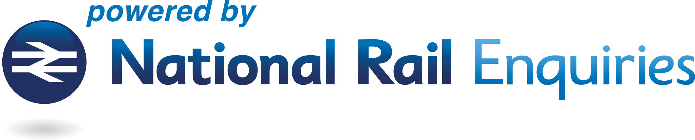

# nationalrail



A [public domain](https://creativecommons.org/publicdomain/zero/1.0/) Python API for fetching train timetables in the UK, using the modern RESTful API.

## Usage

[Register for use with the National Rail site](http://realtime.nationalrail.co.uk/OpenLDBWSRegistration), indicating if this is for personal or corporate use. Once done, National Rail will email you a token. Place this in the environmental var `LDBWS_TOKEN` (e.g. a `.env` file.)

Run as `python -m nationalrail STATION`.

This can take a station code (eg `KGX`) or a name (eg `'king's cross london'`).

## Development

Install with Poetry:

```sh
pip install poetry
poetry install
poetry run python -m nationalrail --help
```

### Building the spec

The API is built from spec using [`openapi-transmog`](https://github.com/yunruse/openapi-transmog).

```sh
CONVERT="https://converter.swagger.io/api/convert"
SPEC_URL="https://realtime.nationalrail.co.uk/LDBWS/static/ldbws.json"
HOST="https://lite.realtime.nationalrail.co.uk/OpenLDBWS/api/20220120"
JQ='.servers[0].url = $host | .info.title = "ldbws" | .paths |= with_entries( .key |= sub("^/api/20220120"; ""))'

curl "${CONVERT}?url=${SPEC_URL}" | jq --arg host "$HOST" $JQ > ldbws.json

python -m openapi-transmog ldbws.json --auth 'token' '$LDBWS_TOKEN' > nationalrail/api.py
```

In addition, the rail database should be downloaded and un-gzipped:

```sh
CORPUS="https://publicdatafeeds.networkrail.co.uk/ntrod/SupportingFileAuthenticate?type=CORPUS"
# download and unzip
jq '.TIPLOCDATA | map(select(.["3ALPHA"] != " ")) | map({(.NLCDESC | ascii_downcase): .["3ALPHA"]}) | add' corpus.json > nationalrail/lookup.json
```

